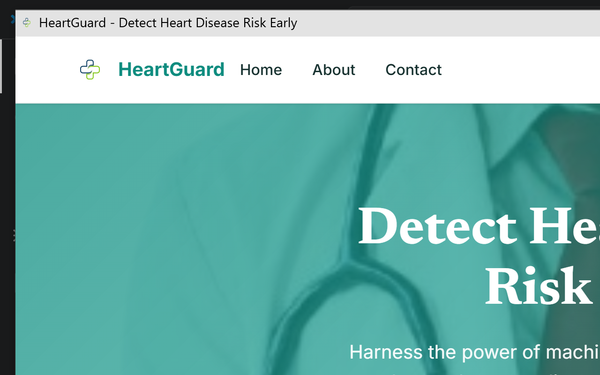
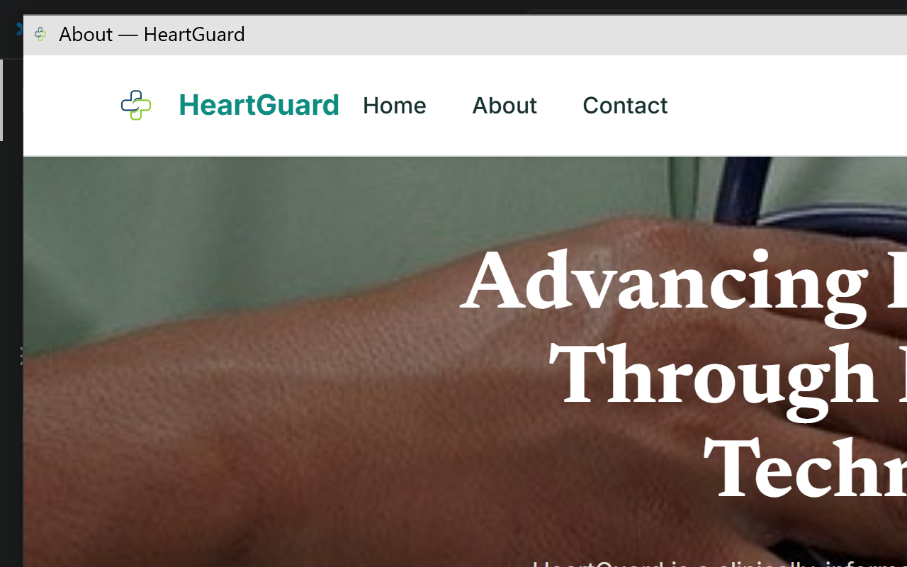
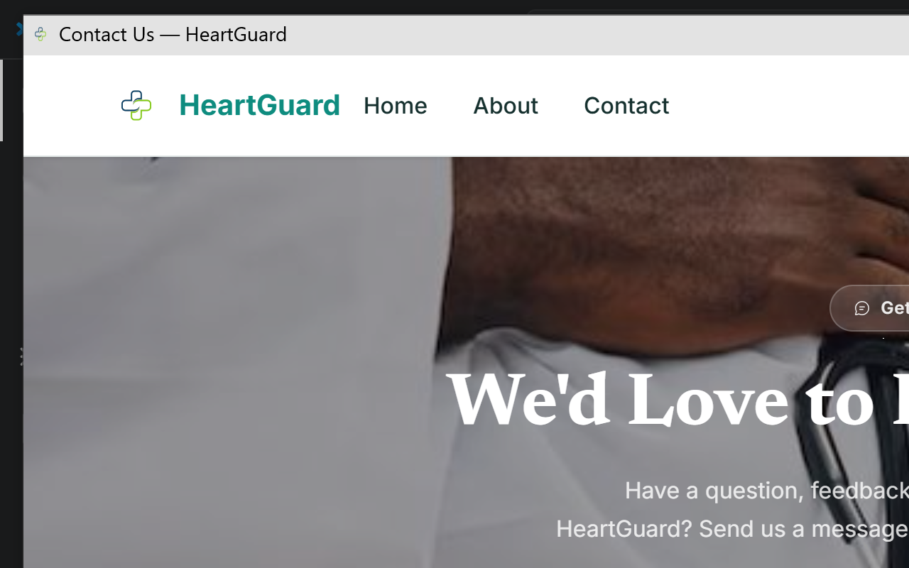
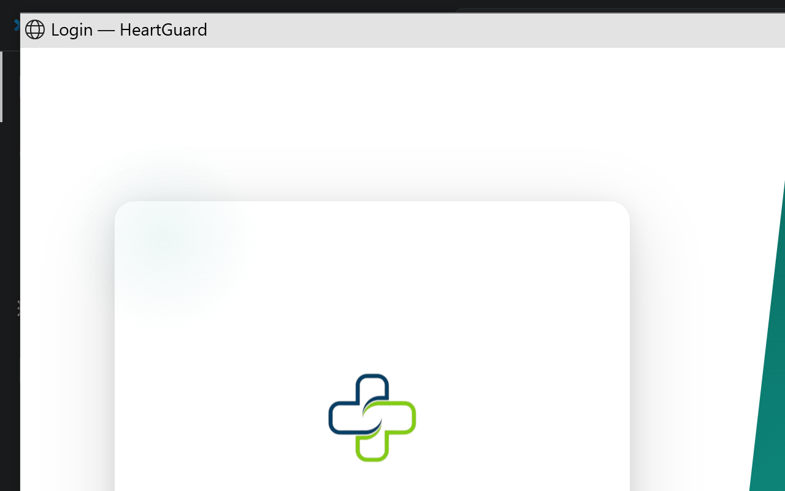

# HeartGuard — Heart Disease Prediction System

<p align="center">
  
</p>

<p align="center">
  
  
  
  
  
</p>

> A clinically-informed, machine-learning-powered heart disease prediction platform designed for healthcare professionals, researchers, and patients. HeartGuard analyzes 13 key physiological parameters to generate a personalized cardiovascular risk score in under a second.

---

## Table of Contents

- [Features](#features)
- [Tech Stack](#tech-stack)
- [Pages & Screenshots](#pages--screenshots)
  - [Public Pages](#public-pages)
  - [Admin Dashboard](#admin-dashboard)
  - [Doctor Portal](#doctor-portal)
  - [Patient Portal](#patient-portal)
- [ML Model](#ml-model)
- [Project Structure](#project-structure)
- [Local Setup](#local-setup)
- [Deployment (Render)](#deployment-render)
- [Environment Variables](#environment-variables)
- [License](#license)

---

## Features

### For Administrators
- Full overview of all diagnoses, patients, and doctors
- Add, edit, delete patients and doctors directly from the dashboard
- Export patients, doctors, and diagnosis results to CSV
- View detailed clinical diagnosis reports with risk classification
- Manage newsletter subscriptions and contact form messages (with unread notification bell)
- Analytics page with risk distribution charts and prediction trends
- Full-text live search across all tables (auto-triggers on typing)

### For Doctors
- Personal dashboard with patient list and recent diagnoses
- Run new heart disease predictions from a clinical input form
- View and manage their assigned patients
- See full diagnosis history with risk scores and clinical parameters

### For Patients
- Personal health dashboard showing all their diagnosis records
- View full clinical details of every diagnosis report
- See assigned doctor and latest risk level at a glance

### Platform-wide
- Role-based access control (Admin / Doctor / Patient)
- Password recovery via Gmail SMTP with a branded HTML email template
- Profile avatar upload (PNG, JPG, JPEG, WEBP, JFIF)
- Dark/light theme toggle (persists across sessions)
- Fully responsive — works on mobile, tablet, and desktop
- About page with animated stats, mission section, and image slideshow
- Contact page with AJAX form submission — messages appear in admin inbox
- Newsletter subscription system
- Scroll-triggered fade-in animations on public pages

---

## Tech Stack

| Layer | Technology |
|---|---|
| Backend | Python 3.11, Flask 3.0.3 |
| ORM / Database | Flask-SQLAlchemy, SQLite (dev) / PostgreSQL (prod) |
| Authentication | Flask-Login, Werkzeug password hashing |
| ML Pipeline | scikit-learn (Random Forest), NumPy, pandas, joblib |
| Email | Flask-Mail, Gmail SMTP |
| Token Security | itsdangerous (URLSafeTimedSerializer) |
| Frontend | Jinja2, Vanilla JS, CSS custom properties |
| Icons | Iconify + Microsoft Fluent UI icon set |
| Fonts | Google Fonts — Inter, Newsreader |
| Production Server | Gunicorn |
| Deployment | Render (Web Service + PostgreSQL) |

---

## Pages & Screenshots

### Public Pages

#### Home Page (`/`)
The landing page with a hero section, feature highlights, animated statistics, how-it-works steps, and a newsletter signup. Fully responsive with a sticky navigation bar and dark/light theme toggle.



---

#### About Page (`/about`)
- Hero with a full-bleed background image and dark overlay
- Animated counter strip (96.5% accuracy, 13 features, 10K+ data points, <1s analysis)
- Mission split section with an auto-cycling image slideshow card
- 6 feature cards with glassmorphism styling
- Technology stack grid
- CTA section in solid system green
- Scroll-triggered fade-in animations on every section



---

#### Contact Page (`/contact`)
- Hero with background image aligned left and dark overlay
- AJAX contact form (Full Name, Email, Subject, Message) with character counter and toast notifications
- Info sidebar: response banner, email, support hours, sign-up CTA card
- No border on info cards — soft gray shadow only
- Submitted messages appear instantly in the admin Messages inbox



---

#### Login Page (`/login`)
Split-panel design with a teal gradient on the left and login form on the right. Includes "Forgot Password?" link that triggers the email-based recovery flow.



---

#### Register Page (`/register`)
Role-selection registration form (Patient or Doctor). Full name, email, and password fields with real-time validation.

---

#### Forgot Password (`/forgot-password`) & Reset Password (`/reset-password/<token>`)
- **Forgot Password**: Sends a branded HTML email with a secure 1-hour reset link via Gmail SMTP. The email embeds the HeartGuard logo as a base64 data URI.
- **Reset Password**: Token-verified page with two password fields, show/hide toggles, and live match feedback.

---

### Admin Dashboard

All admin pages share a collapsible sidebar with grouped navigation, a topbar with global auto-search, notification bell (unread messages count), and user avatar dropdown.

---

#### Admin Overview (`/dashboard/overview`)
Summary statistics (total patients, doctors, diagnoses, high-risk count) followed by a table of all recent diagnoses with live search. Each row has **View** (opens full clinical detail modal) and **Delete** actions.


---

#### Patients (`/dashboard/patients`)
Full paginated patient table with search. **Add Patient** button opens an inline modal to create a new user account and patient profile in one step. Each row has View, Edit, and Delete actions. **Export CSV** downloads the current filtered list.


---

#### Doctors (`/dashboard/doctors`)
Same layout as Patients but for doctors. **Add Doctor** modal creates a User (role=doctor) + Doctor profile. Shows specialty, patient count, diagnosis count, and status per row. **Export CSV** available.

---

#### Detect Heart Disease (`/dashboard/detect`)
Clinical input form with 13 parameters. Sliders for Max Heart Rate (thalach) and ST Depression (oldpeak) with a teal-colored track and thumb. Submits to the ML pipeline and displays a risk result card (High / Medium / Low) with score and clinical breakdown.


---

#### Results (`/dashboard/results`)
All diagnoses in a searchable, paginated table. Auto-search triggers on typing. **Export CSV** button downloads the currently filtered result set.

---

#### Analysis (`/dashboard/analysis`)
Data visualisation page with charts covering risk level distribution, prediction trends over time, and patient demographics.

---

#### Messages (`/dashboard/messages`)
Tabbed inbox with two sections:
- **Newsletter** — all subscriber emails with mark-read / delete per row
- **Contact Messages** — messages submitted from the public contact form; clicking View opens a detail modal and auto-marks it as read

The notification bell in the topbar shows the total unread count across both tabs.

---

#### Settings (`/dashboard/settings`)
Profile settings with a **clickable avatar upload** (96px rounded circle, dashed ring, instant FileReader preview before upload). Password change form. Supports PNG, JPG, JPEG, WEBP, JFIF uploads up to 2 MB.

---

### Doctor Portal

#### Doctor Dashboard (`/doctor/dashboard`)
Personal stats: total patients, diagnoses run, and recent activity. Quick-access cards for running a new diagnosis and viewing patient list.

---

#### My Patients (`/doctor/patients`)
Table of patients assigned to the logged-in doctor. View patient details and diagnosis history.

---

#### Doctor Detect & Results
Same clinical form and results table as the admin, scoped to the doctor's own records.

---

### Patient Portal

#### Patient Dashboard (`/patient/dashboard`)
- Stat cards: total diagnoses, latest risk level, assigned doctor
- Full diagnosis history table with Date, Age, Risk Score (colour-coded), Risk Level, Prediction, and Doctor
- **View** button on each row opens a detailed modal showing all 13 clinical parameters, risk banner, and doctor notes


---

## ML Model

The prediction pipeline is a three-step scikit-learn pipeline:

```
Input (6 features) → StandardScaler → PCA (95% variance) → RandomForestClassifier
```

**Features used:**
| Feature | Description |
|---|---|
| `cp` | Chest pain type (0–3) |
| `oldpeak` | ST depression induced by exercise |
| `ca` | Number of major vessels colored by fluoroscopy (0–3) |
| `thalach` | Maximum heart rate achieved |
| `thal` | Thalassemia type |
| `exang` | Exercise-induced angina |

**Risk classification:**
| Probability | Risk Level |
|---|---|
| ≥ 65% | 🔴 High |
| 35% – 64% | 🟠 Medium |
| < 35% | 🟢 Low |

Model accuracy: **96.5%** on the validation set.

---

## Project Structure

```
HDPS/
├── app.py                        # Application factory & public routes
├── auth.py                       # Auth blueprint (login, register, password reset, avatar)
├── dashboard_routes.py           # Admin blueprint (/dashboard/*)
├── doctor_routes.py              # Doctor blueprint (/doctor/*)
├── patient_routes.py             # Patient blueprint (/patient/*)
├── models.py                     # SQLAlchemy models (User, Doctor, Patient, Diagnosis, ...)
├── ml.py                         # ML prediction pipeline (lazy-loaded)
├── requirements.txt              # Python dependencies
├── render.yaml                   # Render deployment config
├── .gitignore
├── app/
│   ├── models/                   # Trained ML model files (.pkl)
│   │   ├── heart_model.pkl
│   │   ├── scaler.pkl
│   │   ├── pca.pkl
│   │   └── feature_names.pkl
│   ├── static/
│   │   ├── css/
│   │   │   ├── styles.css        # Public pages
│   │   │   ├── dashboard.css     # Dashboard shared styles
│   │   │   ├── flash.css
│   │   │   ├── login.css
│   │   │   └── register.css
│   │   ├── js/
│   │   │   ├── main.js           # Public page JS
│   │   │   └── dashboard.js      # Dashboard JS
│   │   └── images/               # Logos, hero images
│   └── templates/
│       ├── base.html             # Public page base layout
│       ├── index.html
│       ├── about.html
│       ├── contact.html
│       ├── login.html
│       ├── register.html
│       ├── forgot_password.html
│       ├── reset_password.html
│       ├── email/
│       │   └── reset_password.html   # Branded HTML email template
│       ├── dashboard/            # Admin templates
│       ├── doctor/               # Doctor templates
│       └── patient/              # Patient templates
```

---

## Local Setup

### Prerequisites
- Python 3.11+
- pip

### Steps

```bash
# 1. Clone the repository
git clone https://github.com/mira/heart_disease_model_flask_web_app.git
cd heart_disease_model_flask_web_app

# 2. Create and activate a virtual environment
python -m venv venv

# Windows
venv\Scripts\activate

# macOS / Linux
source venv/bin/activate

# 3. Install dependencies
pip install -r requirements.txt

# 4. Run the app
python app.py
```

Open your browser at **http://localhost:5000**

The SQLite database (`instance/hdps.db`) and all tables are created automatically on first run.

---

## Deployment (Render)

This project ships with a `render.yaml` that configures everything automatically.

### Steps

1. **Push to GitHub**
   ```bash
   git remote add origin https://github.com/Animichael/heart_disease_model_flask_web_app.git
   git push -u origin master
   ```

2. **Create a Render account** at [render.com](https://render.com)

3. **New Web Service** → connect your GitHub repository  
   Render will auto-detect `render.yaml` and provision both the web service and the PostgreSQL database.

4. **Add environment variables** (see table below) in the Render dashboard under **Environment**.

5. **Deploy** — Render installs packages with `pip install -r requirements.txt`, starts the app with Gunicorn, and `db.create_all()` runs automatically on boot.

---

## Environment Variables

| Variable | Required | Description |
|---|---|---|
| `SECRET_KEY` | Auto (Render generates) | Flask session secret key |
| `DATABASE_URL` | Auto (Render injects from linked DB) | PostgreSQL connection string |
| `MAIL_USERNAME` | **Set manually** | Gmail address for sending emails |
| `MAIL_PASSWORD` | **Set manually** | Gmail App Password (16-char) |

> **Note:** `MAIL_PASSWORD` must be a [Gmail App Password](https://myaccount.google.com/apppasswords), not your regular Gmail password. Two-Factor Authentication must be enabled on the Gmail account.

---

## License

This project is for **research and educational purposes only** and is not intended for clinical diagnosis or medical decision-making.

---

<p align="center">Built with Flask &amp; scikit-learn · Designed for HeartGuard HDPS</p>
